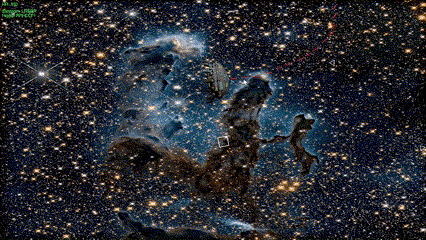
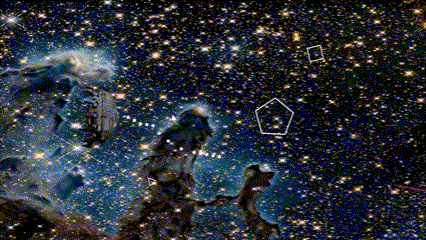
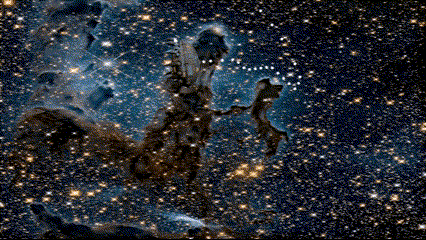
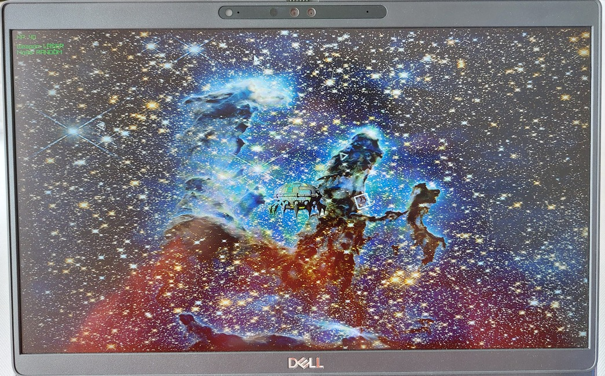

# Lab1
## Lista zmian
- Dodana rotacji statku oraz odpowiednio obracające się pociski 
- Dodanie hp do asteroid, zajmują inną ilość czasu do zabicia w zależności od rozmiaru 
- Dodanie nowej broni - miny, które zadają więcej obrażeń, ale się nie ruszają 
- Dodanie nowej astroidy - GIGA, która jest tylko większa i ma więcej HP 
- Dodanie lepszego losowania asteroid oraz teraz kształt i rozmiar są połączone 
- Ładniejsza tekstura na tło ([źródło](https://images.nasa.gov/details/GSFC_20171208_Archive_e000842))
- Gra teraz odpala się w rozdzielczości ekranu i jest na cały ekran 
- Wyświetlanie trybu
